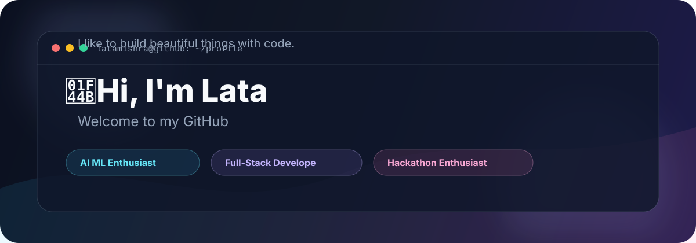

  

<h1 align="center">Lata Mishra</h1>

## 👤 About Me

I am a B.Tech Artificial Intelligence student at **Delhi Skill and Entrepreneurship University** who enjoys building systems at the intersection of **AI ML, and data engineering**.

# 💻 Tech Stack:
                               

# 📊 GitHub Stats:
 
 

### 🔥 GitHub Contribution Chart

  

 

